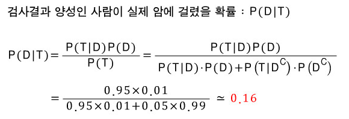

딥러닝을 공부하다 보면 많이 이야기를 듣게되는 베이즈 정리(Bayes's Theorem)에 대한 고찰

## 베이즈 정리란
---
"이전의 경험"과 "현재의 증거"를 기반으로 어떤 사건의 확률을 추론하는 과정을 말한다.  
확률 P(A|B)를 알고 있을 때, 관계가 정반대인 확률 P(B|A)를 계산하기 위해 등장하였음    
**"결과를 관측한 뒤 원인을 추론할 수 있음"**  

이렇게 말하면 사실 이해가 어렵고....  
결국 예시를 통해서 이해하는게 가장 와닿는거 같다

일단 수식을 통해서 증명하는건 고등학교 확률 시간에 배운 '조건부 확률'을 생각하면 쉽다.  
위에서 부터 차근차근 증명해보면 아래와 같이 손쉽게 증명할 수 있다.

> P(A) : A의 관측 확률 (evidence) - 현재의 증거  
> P(B) : B의 사전 확률 (prior probability) - 과거의 경험  
> P(A|B) : 사건 B가 주어졌을 때 A의 조건부 확률 (likelihood)  
> P(B|A) : 사건 A라는 증거에 대한 사후 확률 (posterior probability)

>   
> [손으로 꼬물딱꼬물딱 증명해보았습니다]

예시를 통해서 좀 더 쉽게 이해해보자!

## Example)
---
전세계에 존재하는 인구들의 암이 발생할 확률은 1%  
의사가 환자의 암 진단을 올바르게 할 확률은 95%  
라고 할 때, **암 확정 판정을 받은 사람이 실제로 암에 걸려 있을 확률은 어떻게 되는가?**  

### Ans)
위에서 정리 해놓은 evidence, prior probability 등의 개념을 적절히 잘 대입해서 생각해보면 된다.  

**암이 실제로 발생하는 사건을 D(prior probability)**  

**암 확정을 받는 사건을 T(evidence)**  

라고 하면

우리가 문제로부터 얻을 수 있는 확률 값은 아래와 같다.  
### P(D) = 0.01  
### P(T|D) = 0.95

우리가 궁금해하는 **암 확정 받은 사람이 실제로 암에 걸려 있을 확률**은 

P(D\T)와 같이 표현 가능할테니까  

>   
> [수식에 대입해보면 손쉽게 값을 구할 수 있다]

결국 이렇게 해도 마음 한켠에는 궁금증이 남아 있을 수 있다.

암 확정을 받았던 말던 그 사람이 암에 걸려 있을 확률은 독립적인 사건이 아닐까?! (한 마디로 1% 아닌가?!)

정상적인 사고를 하는 사람이라면 이 의문이 드는게 당연하다고 생각한다.

>   
> [그나마 이해를 도울 수 있는 도식 이미지]

위 도식 이미지와 같이 전세계 인구수를 10,000명이라고 생각해보자

그 중 100명은 실제 암에 걸려있을거고, 9,900명은 건강할거다

그 중 우리가 관찰한 환자는 **암 검사 양성**을 받은 환자고

위 도식에서 볼 수 있듯 95 + 9405 명이 된다

한마디로 우리가 위에서 의문을 제기한 **"암 확정을 받았던 말던"** 이라는 가정이 틀린 것을 확인할 수 있다.

## 딥러닝과 베이즈 정리의 관계
---

그럼 이제 문제를 제기해야 되는 부분은,

> 그래서 이게 뭐? 베이즈 정리랑 딥러닝이랑 무슨 연관성이 있는거지?!

바로 그거다. 끊임없이 내가 학습한 내용을 딥러닝이라는 큰 물줄기로 끌어당겨서 merge할 줄 알아야한다.

나도 베이즈 정리를 공부해본 뒤에 그런 궁금증에 빠졌었는데, 아래 유튜브 링크가 큰 도움이 되었다

> [베이즈 정리에 대한 고찰](https://www.youtube.com/watch?v=R13BD8qKeTg)

요약해보면,

**_베이즈 정리를 이용하면 미래에 획득되는 evidence들에 의해 update되는 parameter가 생기고 이로 인해 미래에 대한 더 정확한 예측을 가능케한다_**

이해가 좀 어려운가?

그럼 아까 위에서 설명했던 **암 환자 진단**의 케이스를 끌고 와서 설명해보면

첫번째 병원에서 "어이구,, 환자님, 암이신거 같아요...." 했을 때는

> 베이즈 정리에 따르면 내가 실제 암에 걸려 있을 확률은 16%야. 괜찮아 희망이 있어.

라고 생각할거다.

대신 이렇게 확보한 posterior probabilty P(D\T) = 16% 가 다음 병원 진단 때는 P(D)로 작용하게 되는거다.

위 요약에서 말했던 것처럼 획득한 evidence가 parameter를 update 시키는 것이다.

그렇게 해서 두번째 병원에서 암 확정을 받았을 때는

**P(D) = 16%**  
**P(T|D) = 95%**  

라는 값들을 가지고 계산을 하게될 것이고, 결론적으로 16%보다 더 높은 확률로 실제 암 환자가 될 것이다

결국 이런 원리들은 딥러닝이 학습하는 원리와 매우 흡사하다고 볼 수 있다

"어떠한 관찰 결과"가 있을 때 "어떤 것일 확률"을 계속적으로 업데이트 해나가면서 정교함을 높이는 과정.

"어떤 이미지 값을 input으로 받았을 때" 그것이 "사과일 확률"을 계속적으로 업데이트해서 사과를 판별하는 DNN 모델을 구축하는 것이라고도 볼 수 있다.

>   
> [P(SPAM|WORD)를 계속해서 업데이트 해가면서 정교한 스팸메일 필터로 거듭나게 될 것이다]

